# Como usar GitHub Pages

Primero hay que verificar que el sitio principal tenga el nombre de `index.html` para que el host pueda abrirla. También hay que crear un archivo README, como este, para que GitHub lo muestre; el proceso no funciona correctamente sin este archivo. Dentro de él debe haber, como mínimo, un encabezado principal (que se añade con un signo numeral, un espacio y el título; así `# Mi pagina web`) y además se puede añadir información de la página web.

Yo en este caso, como pagina usaré una plantilla de [**Plantillas HTML Gratis**][web de plantillas] para ejemplificar un diseño y que al subirlo se vea bonito. Si quiere descargar esta plantilla puede hacer clic en el siguiente enlace: [Bloger][Plantilla]

Primero se requiere instalar “GIT” que es un programa que se encarga de controlar las versiones de un proyecto. Aquí no se profundizará como se utiliza, pero sí que se mostrarán los comandos básicos para poder realizar lo necesario. Este se descarga desde el sitio web de git. Es recomendable siempre descargar la versión estable más reciente.

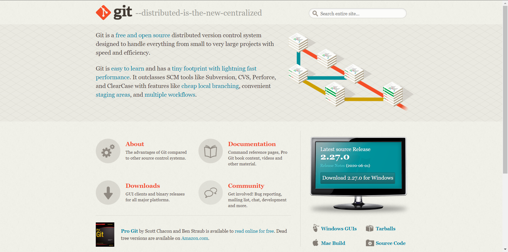

Una vez descargado desde la página oficial e instalado correctamente se procederá a iniciarse el repositorio local en nuestra computadora.

## Iniciar repositorio

Primero hay que abrir la consola de comandos de git, también se puede hacer desde CMD o PowerShell pero me parece más cómodo hacerlo desde ahí.

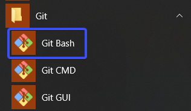

Navegamos hasta el directorio de nuestra página, usando el comando `cd` y acontinuación el nombre de la carpeta `cd desktop`, y luego ejecutamos el comando `git init` como se ve en la imagen:

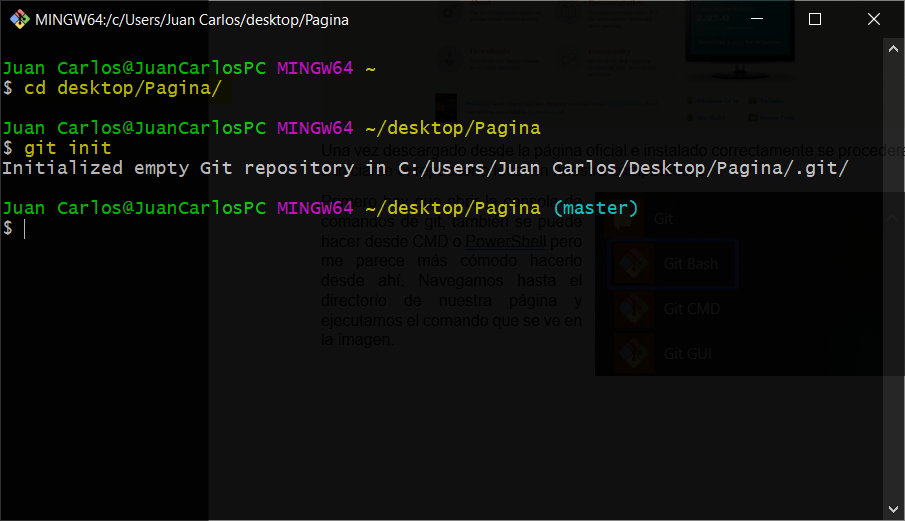

Con esto ya está creado el repositorio localmente. ahora hay que añadir los archivos al área de trabajo, usando el comando `git add` más el nombre del archivo (o `git add .` para agregar todos los archivos), y después hace un `git commit -m "mensaje"`. El mensaje debe de hacer referencia a los cambios del proyecto, de una manera corta.

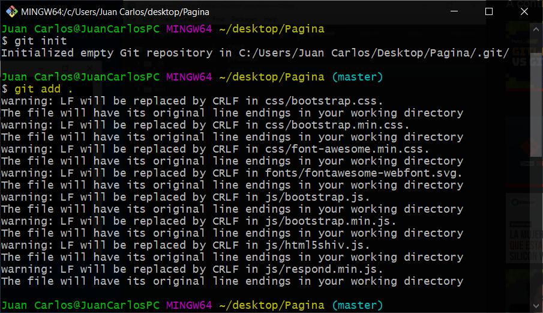
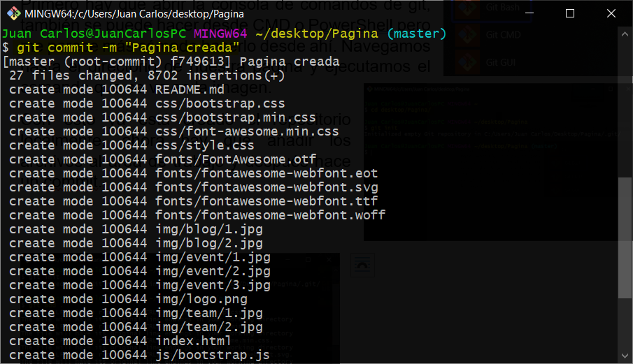

## Repositorio de GitHub

Ahora hay que crear el repositorio en GitHub ya que ahí es donde se guardará y permitirá también utilizar el servicio GitHub Pages (Ojo, este servicio sólo funciona en páginas estáticas, para páginas webs dinámicas que requieran de consultas a bases de datos se requiere otro tipo de host).

Primero hay que crear una cuenta de GitHub, iniciar sesión en ella, luego hay que darle clic al menú que sale al dale clic al avatar y darle al botón de los repositorios.

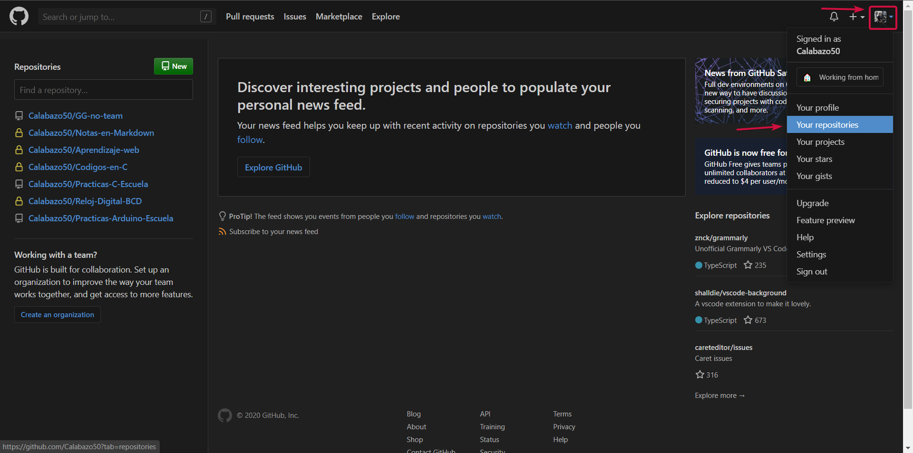

En esta página se muestran los repositorios que tiene el usuario en GitHub, si es una cuenta nueva aparecerá todo vacío, hay que darle a New para crear un nuevo repositorio.

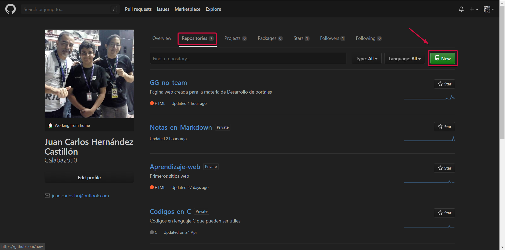

Dentro de la página hay que ir al recuadro que se señala y añadir un nombre al repositorio, recomiendo que sea el nombre de la pagina web, pero puede ser cualquier otro, este nombre no se puede repetir ya que es propio del repositorio. Hay que asegurarse que el repositorio sea público, de lo contrario no funcionará. El resto no hace falta modificarlo, sólo hay que darle clic a crear repositorio.

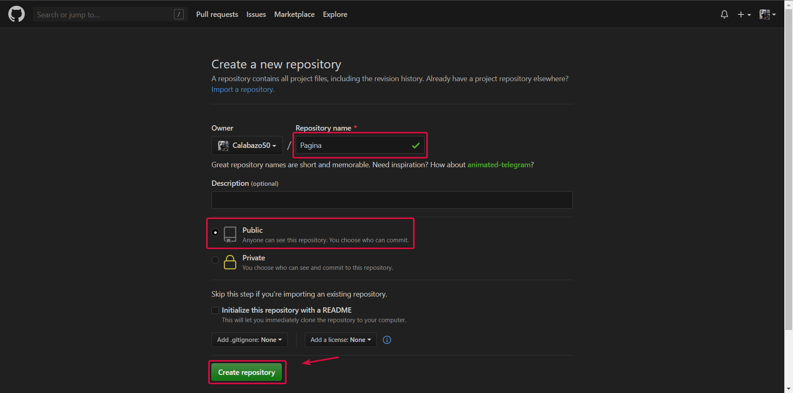

El repositorio ahora mismo está vacío por lo que hay que vincularlo y subir los archivos. Para eso, la página ya te indica lo que debes de hacer y es copiar los dos comandos señalados en la imagen y ejecutarlos en la consola.

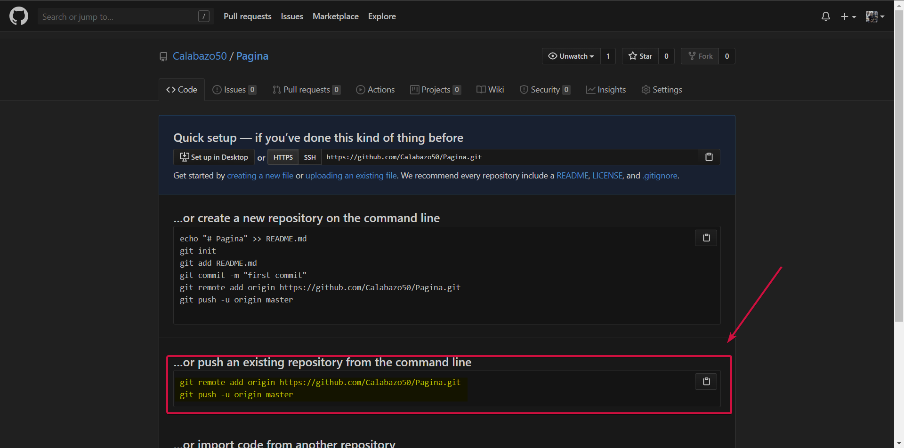
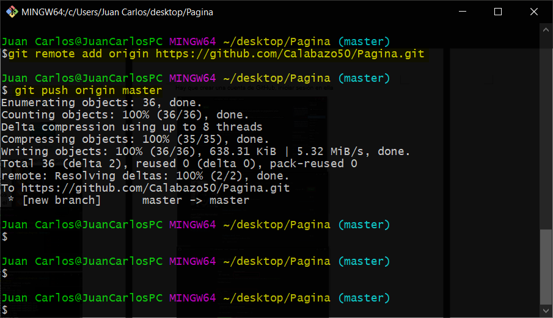

Hay que aclarar que todos los cambios que se hagan deben hacerse en la carpeta del proyecto donde se inició git, o clonar el repositorio desde GitHub si es que se perdió la original, esto es para poder seguir subiendo los cambios al repositorio, y no crear uno nuevo cada vez que se realiza cada cambio.

## Activar Github Pages

Al recargar la pagina se mostrarán todos los archivos del proyecto, incluido el README que se muestra abajo. Para habilitar el servicio hay que ir a la pestaña de settings.

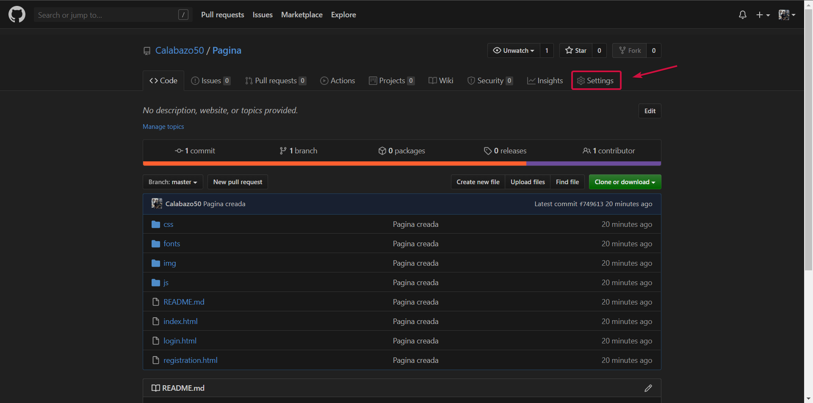

Ahí hay que bajar hasta encontrar la opción, darle clic en el botón que se marca en la imagen y seleccionar Master Brach, esto para que cada vez que hagamos un “git push origin master” se actualicen los cambios en la página.

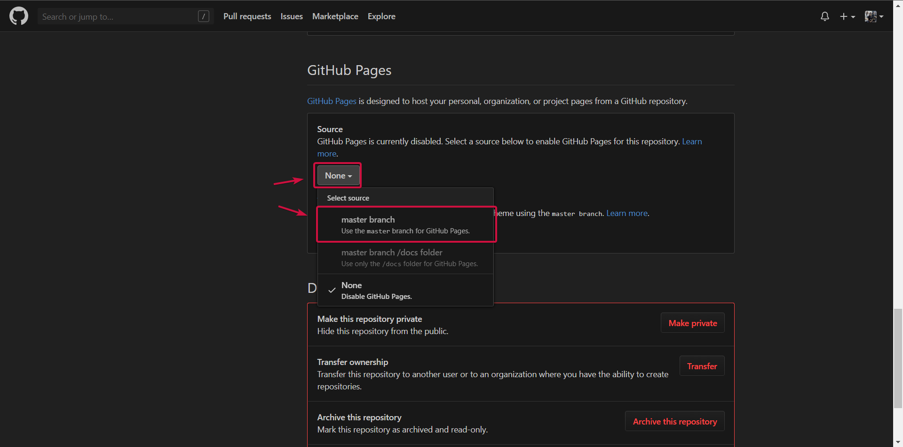

Una vez seleccionado, se recargará automáticamente la página y si se vuelve a bajar se encontrará la dirección URL del sitio. 

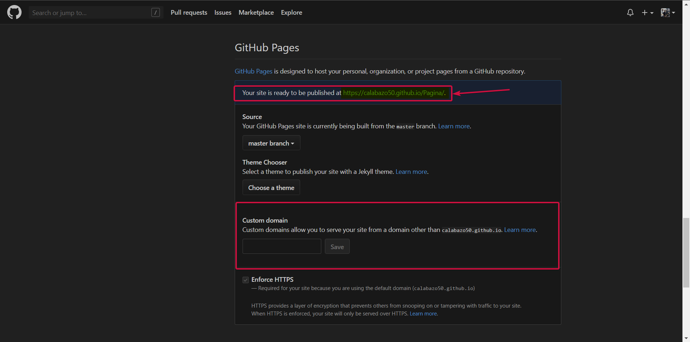

Adicionalmente en la parte de abajo, hay una opción para cambiar el dominio, ya que por defecto es el que proporciona GitHub, pero para ello hay que hacer otro proceso.
Si se ingresa a la URL se abrirá el [sitio web][pagina web de ejemplo].

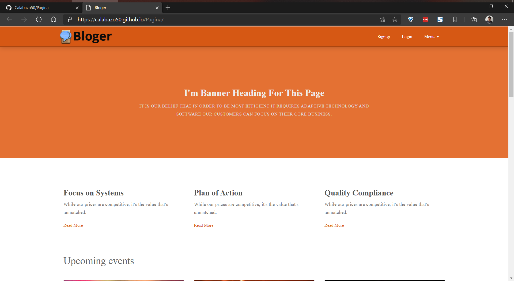

Nuevamente recalco que el sitio web de la imagen de arriba no me pertenece y que es solo una plantilla de [Plantillas HTML Gratis][web de plantillas] y que la plantilla utilizada es [Bloger][Plantilla].

<!-- Enlaces -->

[pagina web de ejemplo]: https://calabazo50.github.io/GitHub-Pages/index.html "Sitio web del ejemplo"

[web de plantillas]: https://plantillashtmlgratis.com/ "Página a la que le pertenece la plantilla"

[Plantilla]: https://plantillashtmlgratis.com/todas-las-plantillas/plantilla/plantillas-html-css-para-descargar-gratuita-bloger/ "Plantilla usada"
